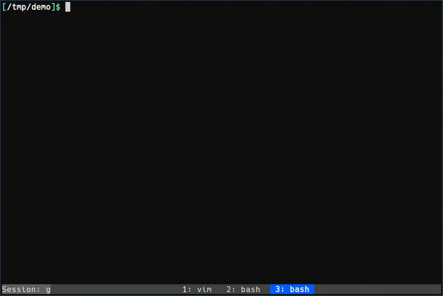

# goj

勉強として作っているAtCoderの補助ツールです。
(プログラミング初心者が作ったツールなので品質は察してください)


# 使い方


## 設定ファイル

`~/.config/goj/config.toml`に設定ファイルが置かれます。
デフォルトで使う言語や生成するテンプレートファイル等を変更出来ます。


## ログイン

```
$ goj login
```

ユーザー名とパスワードを聞かれるので入力してください。
cookiejarが~/.cache/goj/cookiejarに保存されます。
コンテスト本番時以外はログインは不要です。


## テストケースのダウンロード

```
$ goj download [url] or [contest/problem] or [contest] [-l language]
```

`https://atcoder.jp/contests/contest/tasks/problem`のサンプルケースをダウンロードします。

`[contest]`を渡した場合はコンテストの問題すべてのサンプルケースをダウンロードします。

どちらも省略して単に`goj download`とした場合はカレントディレクトリの名前をコンテスト名と見なしダウンロードします。

`[-l language]`で作成されるテンプレートファイルの言語を変更出来ます。

ダウンロードした問題の情報は`./goj.toml`に記録されます。


## テスト

```
$ goj test [problem] [-l language] [-c command]
```

問題problemのテストを行います。
problemは問題名のsuffixに一致していれば大丈夫です。
例えばabc175_bであれば`goj test b`でいいです(あるいは`goj test 75_b`とかでも)。

`[problem]`を省略した場合は最後に編集されたファイルの名前を問題名と見なしてテストします。

`[-l language]`でテストする言語を変更出来ます。

`[-c command]`でテストするコマンドを指定できます。この場合problemは必須になります。


## 提出

```
$ goj submit [problem] [-l language] [--skip]
```

問題problemに対してテストを行い成功したら`problem.cpp`を提出します。
コンテスト名は`./goj.toml`から取得するため、`goj download`した問題でなければ提出出来ません。

`problem`を省略した場合は最後に編集されたファイルの名前を提出する問題と見なします。

`[-l language]`で提出する言語を変更出来ます。

`[--skip]`でテストをスキップ出来ます。


## その他コマンド


### `goj status [contest]`

contestでの自分の提出結果を表示します。


# demo


